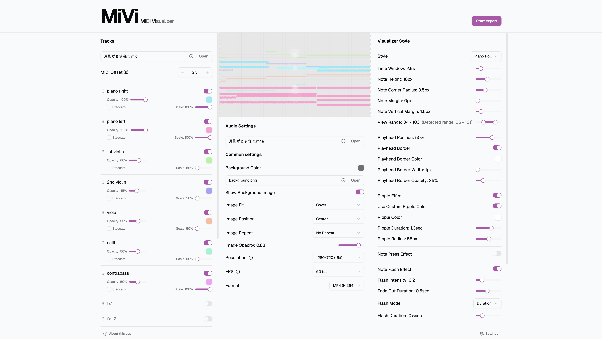

# MiVi: MIDI Visualizer

Transform your MIDI files into stunning visual experiences.

[](https://codecov.io/github/sunya9/mivi)



[**Try MiVi →**](https://sunya9.github.io/mivi/)

---

## Features

- **Visualizer Styles** - Piano Roll and Comet modes
- **Deep Customization** - 30+ adjustable parameters, colors, and effects
- **Playback Control** - Play, pause, seek, and track management
- **Video Export** - Export visualizations as video files
- **PWA Support** - Install as standalone app, works offline

---

## Development

### Prerequisites

- Node.js (v22 or later)
- pnpm (v10 or later)

### Setup

```bash
git clone https://github.com/sunya9/mivi.git
cd mivi
pnpm install
pnpm dev
```

Then open `http://localhost:5173` in your browser.

---

## Contributing

Contributions are welcome! Bug fixes and small improvements can be submitted as a PR directly. For new features or large changes, please open an issue first to discuss.

---

## License

[MIT License](LICENSE)
