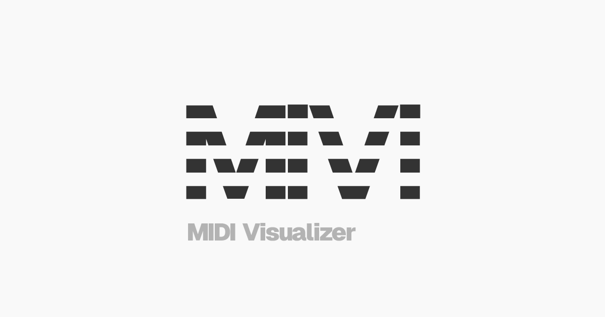

# MiVi: MIDI Visualizer

## Overview

MiVi is a powerful MIDI visualization tool that transforms MIDI files into beautiful visual representations. It allows users to visualize music in real-time, customize the visual style, and export the visualizations as videos.

### Key Features

- **MIDI File Visualization**: Upload and visualize MIDI files with customizable visual styles
- **Track Management**: Enable/disable specific MIDI tracks for visualization
- **Real-time Playback**: Play, pause, and seek through MIDI files with synchronized visuals
- **Customizable Visuals**: Adjust colors, shapes, animations, and other visual parameters
- **Responsive Design**: Works on both desktop and mobile devices
- **Video Export**: Export visualizations as video files
- **PWA Support**: Install as a standalone application on supported devices

## Getting Started

### Prerequisites

- Node.js (v18 or later)
- pnpm (v10 or later)

### Installation

1. Clone the repository:

   ```bash
   git clone https://github.com/sunya9/mivi.git
   cd mivi
   ```

2. Install dependencies:

   ```bash
   pnpm install
   ```

3. Start the development server:

   ```bash
   pnpm dev
   ```

4. Open your browser and navigate to `http://localhost:5173`

## Development

### Build

To build the application for production:

```bash
pnpm build
```

The build output will be in the `dist` directory.

### Preview Production Build

```bash
pnpm preview
```

## License

[MIT License](LICENSE)
